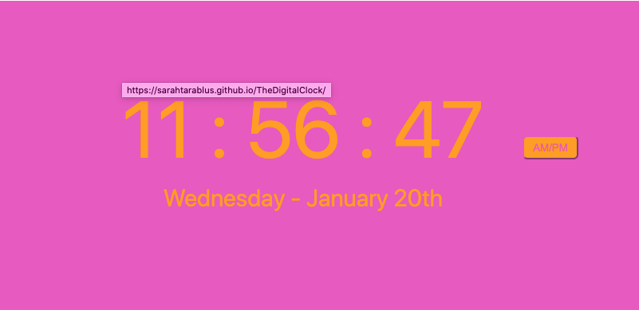

# Vanilla JavaScript Digital Clock   

*A digital clock written in pure JavaScript, HTML and CSS*

See it [here](https://sarahtarablus.github.io/TheDigitalClock/)      

## Summary
This was my first project and I learned different ways of rendering a date in JavaScript

## Author
- Sarah Tarablus - *Full Stack Developer* 