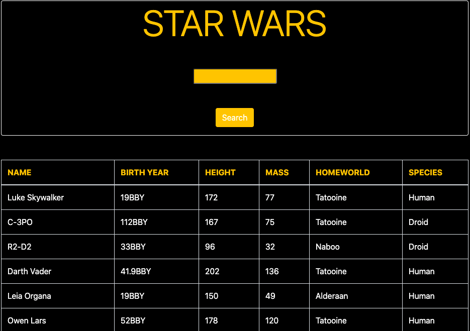

# Star Wars Api App

 *Star Wars Api App written with React, HTML and CSS*  

 Check out the app [here](https://apistar-wars.herokuapp.com/) 

### Expense Tracker React
 

## Summary
With this project I learned how to send Api requests and how to work with the data. To write this app I used React, HTML and CSS. 

## Author
**Sarah Tarablus** - *Full-stack software developer* 